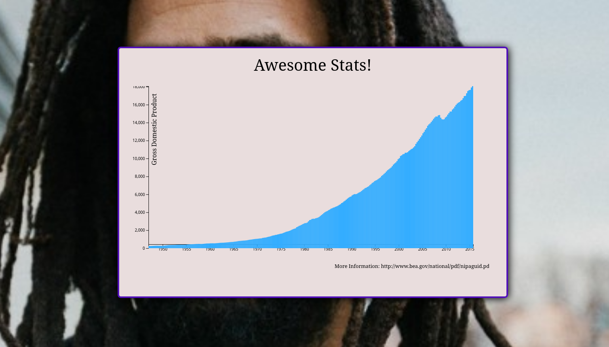

# Awesome Bar Chat app

> This is my first project about after learning Data visualization with FreeCodeCamp

## Big Picture



## Creation of a repo and pushing acts on the command line

```git
echo "# awesome-bar-chat-dv1" >> README.md
git init
git add README.md
git commit -m "first commit"
git branch -M main
git remote add origin https://github.com/Gadrawingz/awesome-bar-chat-dv1.git
git push -u origin main
```